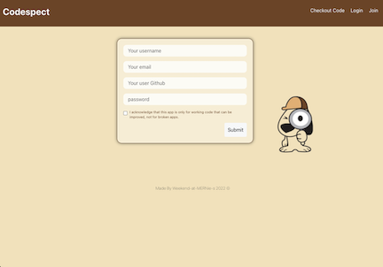

# 
**CODESPECT**

## 
**A social networking app where users can upload and rate code files to help others improve projects and build up their coding confidence.**
 
### 
Created by Weekend at MERNie's 2022

## 
**TABLE OF CONTENTS**

***
1. **[Contributers](#contributers)**
2. **[Challenges/Successes](#challenges/successes)**
3. **[Deployment](#deployment)**
4. **[Usage](#usage)** 

## 
**CONTRIBUTERS**

***
- ## **Abi Ponce** 
    Back end routing and debugging 
    **[Email](abiponce.ap@gmail.com)** 
    **[GitHub](http://www.github.com/apjuve)** 

- ## **Adam Pritts:** 
    Back end routing and debugging 
    **[Email](agpritts@gmail.com)**  
    **[GitHub](http://www.github.com/agpritts)** 

- ## **Blair Seivers:** 
    Front end UI and routing 
    **[Email](blair.seivers@gmail.com)** 
    **[GitHub](http://www.github.com/dogmom3)** 

- ## **Geiciane Barham** 
    Front and back end debugging, routing, models and UI styling 
    **[Email](Geicianecosta43@gmail.com)** 
    **[GitHub](https://github.com/geicibarham)** 

- ## **Jordan Hessler** 
    Front and back end endpoints, routing, debugging and models 
    **[Email](jhessler11@gmail.com)** 
    **[GitHub](http://www.github.com/jhessler11)** 

- ## **Mark Healy** 
    Heroku deployment and Scrum master
    **[Email](gmarkghealy@gmail.com)**  
    **[GitHub](http://www.github.com/utilrr)**  

## 
**CHALLENGES & SUCCESSES**

***
### Challenges:
* Consistancy in the names of endpoints for the front and back end.
* Learning more about working with back end functionality for those of us that weren't as comfortable in that area.
* React state managenment.
* Using GraphQL for the first time.
* Fixing _**tons**_ of errors!
### Successes:
* Taking all of those errors as learning opportunities.
* Helping each other solve problems.
* Using refetch query.
* Having one person handle the deployment.
* Learning new programs and skills.

## 
**DEPLOYMENT**

***
### 
You can find our app deployed **[here on Heroku](secure-inlet-72014.herokuapp.com/)**

## 
**USAGE**

***
### 
_When you open up the app, you will arrive at this home page that gives you a brief explanation of what it is all about. You are instructed to sign up for an account to connect with other developers. As you can see in the nav bar, you can still see the 'Checkout Code' page, but without an account, you will not be able to interact with any features._

### 
_When you click on 'Join' in the nav bar, you will be taken to this page to enter your information to sign up for an account._

### 
_Here is the main page referred to as 'Checkout Code', where you can see a list of all users posts. Once logged in, you will be able to leave comments to help out other developers, like posts with really imrpessive code, or flag posts that maybe have some errors in their files to correct._

### 
_Lastly, we have the user page, where you can create new posts and view all of your own existing posts._

